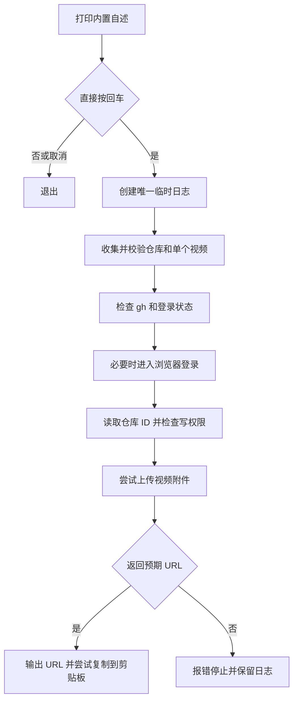

# `【MacOS】🎬上传GitHub视频附件.command`


[toc]

---

## 🔥 <font id=前言>前言</font>

接收 [**GitHub**](https://github.com) 仓库地址和一个本地视频文件，通过 [**gh**](https://formulae.brew.sh/formula/gh) 尝试上传视频附件。上传成功后输出 `https://github.com/user-attachments/assets/…` URL，并复制到剪贴板，供手动插入目标 `README.md`。

**当前上传接口尚未实测。** 脚本直接请求 `https://uploads.github.com/user-attachments/assets`；本说明描述现有实现，不保证该端点接受当前请求或返回预期的 `.url` 字段。真实上传、附件访问和 README 播放效果需要在目标仓库验证。

## 一、用途与能力边界 <a href="#前言" style="font-size:17px; color:green;"><b>🔼</b></a> <a href="#🔚" style="font-size:17px; color:green;"><b>🔽</b></a>

适合为项目 README 准备演示视频附件链接。每次运行只处理一个本地文件。

| 项目 | 当前行为 |
| --- | --- |
| 视频格式 | 按扩展名接受 `.mp4`、`.mov`、`.webm`，大小写均可 |
| 目标平台 | 固定为 `github.com`，不支持自建 GitHub Enterprise 主机 |
| 仓库要求 | 当前账号能读取仓库，且 API 返回 `.permissions.push = true` |
| 上传产物 | 预期返回一个附件 URL；不把视频加入仓库文件或 Release |
| 本地影响 | 创建临时日志，成功后尝试覆盖剪贴板内容；不修改源视频 |
| 文档与版本控制 | 不改写 README，不创建提交，不推送代码 |
| 重试策略 | 上传失败后停止，不自动重试；没有去重、断点续传或附件删除功能 |

脚本只校验文件存在、可读、非空和扩展名，不检测视频编码、不压缩、不转码，也不提前校验平台大小限制。平台支持的附件格式、大小和访问规则以 [**GitHub 附件文档**](https://docs.github.com/en/get-started/writing-on-github/working-with-advanced-formatting/attaching-files) 为准。

## 二、执行前检查 <a href="#前言" style="font-size:17px; color:green;"><b>🔼</b></a> <a href="#🔚" style="font-size:17px; color:green;"><b>🔽</b></a>

- 使用 macOS 终端和系统 `zsh`，确保网络能够访问 `github.com` 与 `uploads.github.com`。
- 预先安装 `gh`。脚本会查找当前 `PATH` 和 Apple Silicon / Intel 的常见安装目录，但不会自动安装或升级工具。
- 确认当前账号具有目标仓库写权限。未通过登录检查时，脚本会进入浏览器登录流程。
- 准备一个允许上传的视频文件。附件会离开本机，上传前检查视频内容和目标仓库。

只读检查命令：

```shell
gh --version
gh auth status --hostname github.com
```

已安装 [**Homebrew**](https://brew.sh/) 时，可手动安装缺失的 `gh`：

```shell
brew install gh
```

也可以先手动完成登录：

```shell
gh auth login --hostname github.com --web
```

登录行为与凭据保存方式参见 [**gh 登录手册**](https://cli.github.com/manual/gh_auth_login)。不要把 Token 写入脚本、README 或上传文件。

## 三、运行方式 <a href="#前言" style="font-size:17px; color:green;"><b>🔼</b></a> <a href="#🔚" style="font-size:17px; color:green;"><b>🔽</b></a>

### 3.1、双击或交互运行 <a href="#前言" style="font-size:17px; color:green;"><b>🔼</b></a> <a href="#🔚" style="font-size:17px; color:green;"><b>🔽</b></a>

双击同目录的 `【MacOS】🎬上传GitHub视频附件.command`，或在本 README 所在目录执行：

```shell
zsh './【MacOS】🎬上传GitHub视频附件.command'
```

1、阅读终端里的内置自述。直接按回车继续，输入其它字符后回车会退出；按 `Ctrl+C` 取消。

2、输入目标仓库首页地址或 `owner/repo`。

3、输入本地视频路径，也可以从 Finder 拖入一个视频文件。不要同时拖入多个文件。

4、按提示完成必要的登录，等待仓库权限检查及上传结果。

5、成功后复制 URL，手动插入目标 README。剪贴板不可用时，从终端或日志复制。

### 3.2、命令行传参 <a href="#前言" style="font-size:17px; color:green;"><b>🔼</b></a> <a href="#🔚" style="font-size:17px; color:green;"><b>🔽</b></a>

脚本接受零个参数或恰好两个参数；只传一个参数或多传参数会报错。参数顺序固定为“仓库地址、本地视频路径”，没有 `--help` 或其它选项。

```shell
zsh './【MacOS】🎬上传GitHub视频附件.command' \
  'owner/repo' \
  './演示视频.mp4'
```

将示例的 `owner/repo` 和视频路径替换为实际值。相对视频路径以启动命令时的当前工作目录为基准；含空格或中文时，用引号包住整个路径。

**传入参数仍会等待首次回车确认**，不适合直接作为无人值守上传任务。

### 3.3、仓库地址格式 <a href="#前言" style="font-size:17px; color:green;"><b>🔼</b></a> <a href="#🔚" style="font-size:17px; color:green;"><b>🔽</b></a>

| 格式 | 示例 |
| --- | --- |
| 仓库短名 | `owner/repo` |
| HTTPS 首页地址 | `https://github.com/owner/repo` |
| HTTPS 克隆地址 | `https://github.com/owner/repo.git` |
| SSH 克隆地址 | `git@github.com:owner/repo.git` |

支持去除仓库地址末尾的一个 `/` 和 `.git` 后缀。不接受 README 文件页、Issue 页、分支页面、带查询参数的地址或 `ssh://` 形式。

## 四、URL 使用与执行流程 <a href="#前言" style="font-size:17px; color:green;"><b>🔼</b></a> <a href="#🔚" style="font-size:17px; color:green;"><b>🔽</b></a>

把实际返回的附件 URL 单独放入目标 README 的一段，前后保留空行。下面仅展示格式，示例地址不可播放：

```markdown
## 演示视频

https://github.com/user-attachments/assets/替换为实际附件ID

```

粘贴后，在目标 GitHub README 页面检查渲染和播放效果；其它 Markdown 阅读器可能只显示普通链接。脚本只检查返回 URL 的格式，不验证链接可访问或视频可播放。

以下流程使用 [**Mermaid**](https://mermaid.js.org) 表示：



参数、工具、登录或仓库检查失败时也会提前停止，不进入上传步骤。

## 五、日志与文件结构 <a href="#前言" style="font-size:17px; color:green;"><b>🔼</b></a> <a href="#🔚" style="font-size:17px; color:green;"><b>🔽</b></a>

```text
【MacOS】🎬上传GitHub视频附件.command/
├── 【MacOS】🎬上传GitHub视频附件.command
└── README.md
```

首次确认后，通过 `mktemp` 在系统临时目录创建独立日志，文件名形如 `【MacOS】🎬上传GitHub视频附件.XXXXXX`，末尾是随机字符，**没有固定 `.log` 后缀**。启动、成功和失败提示会显示实际路径；确认前取消不会创建日志。

日志包含业务提示、登录检查输出、API 错误，以及成功时的附件 URL。每次运行创建新日志；系统可能清理临时目录，需要排查时及时保存。

## 六、上传与删除风险 <a href="#前言" style="font-size:17px; color:green;"><b>🔼</b></a> <a href="#🔚" style="font-size:17px; color:green;"><b>🔽</b></a>

- 首次回车确认后，脚本可进入登录和远端上传流程；上传没有第二次 `YES` 确认。
- 重复运行可能创建多个附件。网络中断或返回结果异常时，不能据此判断服务器一定没有收到文件，重试前先核实。
- 删除本地视频或 README 中的链接，不应视为远端附件已删除。脚本没有删除接口；需要永久删除时，联系 [**GitHub Support**](https://support.github.com/)，提供附件 URL。相关说明见 [**GitHub 附件删除讨论**](https://github.com/orgs/community/discussions/153721)。
- GitHub 工作人员曾说明，删除整个远端仓库会触发附件延迟清理；这是历史说明，不是即时删除承诺，也不应为了清理单个视频而删除仓库。参见 [**GitHub 私有附件讨论**](https://github.com/orgs/community/discussions/54551)。

## 七、验证状态 <a href="#前言" style="font-size:17px; color:green;"><b>🔼</b></a> <a href="#🔚" style="font-size:17px; color:green;"><b>🔽</b></a>

- 已按现有源码核对参数、格式校验、登录与权限检查、日志命名、上传请求和剪贴板行为。
- 已通过 `zsh -n` 静态语法检查；该检查不验证网络接口或真实上传能力。
- 未执行真实登录、上传、删除或 README 播放测试。上传接口可用性、响应字段及附件访问行为尚未确认。

## 八、常见问题 <a href="#前言" style="font-size:17px; color:green;"><b>🔼</b></a> <a href="#🔚" style="font-size:17px; color:green;"><b>🔽</b></a>

| 问题 | 排查方式 |
| --- | --- |
| 提示需要 GitHub CLI | 检查 `gh --version`；安装后重新打开终端运行 |
| 登录失败或账号错误 | 执行 `gh auth status --hostname github.com`，确认登录账号和授权状态 |
| 无法读取仓库或没有写权限 | 检查仓库地址、账号权限和组织授权；脚本要求 `.permissions.push = true` |
| 视频不存在、不可读或为空 | 检查实际文件和启动时工作目录；交互输入只拖入一个文件，传参时给路径加引号 |
| 格式不支持 | 使用真实 MP4、MOV、WEBM 文件；修改扩展名不会完成转码 |
| HTTP 错误或服务返回异常 | 保存日志，检查上传端点、鉴权与响应结构；该请求尚未实测，勿连续盲目重试 |
| 超过平台限制 | 按官方附件文档检查当前限制，先自行压缩或缩短视频；脚本不会预检大小 |
| URL 已输出但未复制 | 从终端或日志手动复制；`pbcopy` 失败不会触发重新上传 |
| README 中不能播放 | 检查使用的是实际附件 URL，并在 GitHub 页面验证；脚本不验证编码和渲染 |

上传请求使用 `gh api --input` 读取视频二进制，同时通过 `--raw-field` 传入文件名、内容类型和仓库 ID。按 [**gh API 手册**](https://cli.github.com/manual/gh_api)，与 `--input` 同用的字段会进入 URL 查询参数；出现请求错误时需要核对服务端是否接受这种请求形式。

<a id="🔚" href="#前言" style="font-size:17px; color:green; font-weight:bold;">我是有底线的➤点我回到首页</a>
