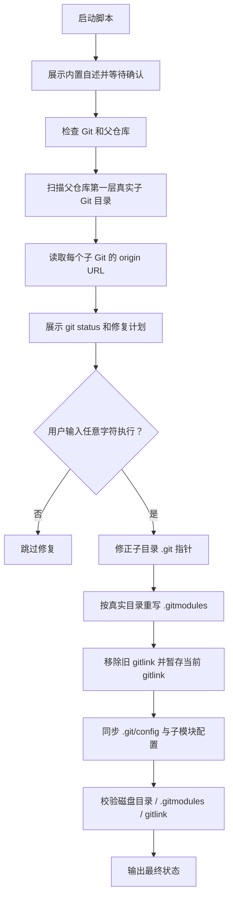

# `【MacOS】🧭更新引用Git父仓=>子仓.command`


[toc]

---

## 🔥 <font id=前言>前言</font>

- 这个脚本用于修复父 [**GitHub**](https://github.com) / Git 仓库管理多个子 Git 时，目录改名后引发的子模块元数据错位问题。
- 脚本以当前磁盘上真实存在的第一层子 Git 目录为基准，对齐 `.gitmodules`、父仓库 gitlink、本地 `.git/config` 和子目录 `.git` 指针。
- 脚本会自动定位目标父 Git 仓库：优先处理脚本所在目录上一层的 Git 仓库；如果脚本直接放在 Git 根目录，则处理当前目录。
- 在当前“一脚本一目录”结构中，目标父仓库就是：

  ```shell
  ..
  ```

## 一、适用场景 <a href="#前言" style="font-size:17px; color:green;"><b>🔼</b></a> <a href="#🔚" style="font-size:17px; color:green;"><b>🔽</b></a>

- 当前磁盘目录名已经是你想要的最终形态，但普通 `git status` 输出和真实目录不一致。
- `.gitmodules` 里残留旧目录名、旧子模块名、重复配置或不存在的路径。
- 子目录 `.git` 文件仍指向旧的 `.git/modules/旧目录名`，导致父仓库执行 `git status`、提交或 SourceTree 刷新时报错。
- 父仓库索引里还残留磁盘上已经不存在的旧 gitlink。

## 二、会修改什么 <a href="#前言" style="font-size:17px; color:green;"><b>🔼</b></a> <a href="#🔚" style="font-size:17px; color:green;"><b>🔽</b></a>

- 会按当前真实子 Git 目录重写父仓库 `.gitmodules`。
- 会修正子 Git 目录里的 `.git` 指针文件，例如把旧指向改成当前目录名对应的 `.git/modules/当前目录名`。
- 会清理父仓库索引里已经不存在于磁盘上的旧 gitlink。
- 会重新执行 `git submodule init` 和 `git submodule sync --recursive`，让本地 `.git/config` 跟 `.gitmodules` 对齐。
- 不会删除当前磁盘上的子 Git 目录。旧 gitlink 使用的是 `git rm --cached`，只移出父仓库索引。

## 三、运行方式 <a href="#前言" style="font-size:17px; color:green;"><b>🔼</b></a> <a href="#🔚" style="font-size:17px; color:green;"><b>🔽</b></a>

- 双击运行：

  ```shell
  【MacOS】🧭更新引用Git父仓=>子仓.command
  ```

- 终端运行：

  ```shell
  chmod +x './【MacOS】🧭更新引用Git父仓=>子仓.command'
  './【MacOS】🧭更新引用Git父仓=>子仓.command'
  ```

- 脚本会先展示内置自述，按回车后进入检查流程。
- 真正执行修复前还会二次询问：直接回车执行；输入任意字符后回车跳过。

## 四、执行前检查 <a href="#前言" style="font-size:17px; color:green;"><b>🔼</b></a> <a href="#🔚" style="font-size:17px; color:green;"><b>🔽</b></a>

- 确认当前磁盘上的第一层子 Git 目录名就是最终想保留的目录名。
- 确认每个子 Git 目录都能找到 `remote.origin.url`。如果某个子目录完全没有远端地址，脚本会停止，避免写坏 `.gitmodules`。
- 如果父仓库里有其它未提交改动，脚本不会回滚；修复完成后需要你自己决定是否一起提交。

## 五、流程图 <a href="#前言" style="font-size:17px; color:green;"><b>🔼</b></a> <a href="#🔚" style="font-size:17px; color:green;"><b>🔽</b></a>



## 六、日志文件 <a href="#前言" style="font-size:17px; color:green;"><b>🔼</b></a> <a href="#🔚" style="font-size:17px; color:green;"><b>🔽</b></a>

- 日志会同步写入：

  ```shell
  $TMPDIR/【MacOS】🧭更新引用Git父仓=>子仓.log
  ```

- 如果修复中断，优先查看日志里的最后一段错误输出。

## 七、风险说明 <a href="#前言" style="font-size:17px; color:green;"><b>🔼</b></a> <a href="#🔚" style="font-size:17px; color:green;"><b>🔽</b></a>

- 这个脚本会改 Git 元数据，不是纯查看脚本。
- 脚本判断标准是“当前磁盘目录优先”。如果你当前目录名本身还没整理好，请先改目录，再运行脚本。
- 脚本不会执行 `git commit`、`git push`，也不会删除当前子 Git 目录。

## 八、常见问题 <a href="#前言" style="font-size:17px; color:green;"><b>🔼</b></a> <a href="#🔚" style="font-size:17px; color:green;"><b>🔽</b></a>

- 如果提示无法读取某个子 Git 的 `origin URL`，进入对应子目录补齐远端：

  ```shell
  git remote add origin git@github.com:JobsKits/仓库名.git
  ```

- 如果修复后仍有父仓库未暂存文件，说明那些是修复前就存在的普通工作区改动，需要单独判断是否提交。
- 如果 `git submodule status --recursive` 能正常列出所有当前子 Git，说明子模块基础配置已经恢复。

<a id="🔚" href="#前言" style="font-size:17px; color:green; font-weight:bold;">我是有底线的➤点我回到首页</a>
