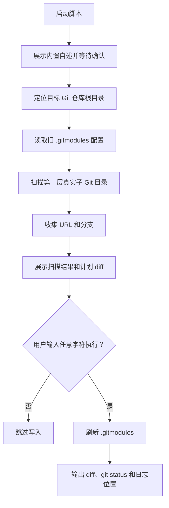

# `【MacOS】🧾更新Git子模块配置.command`


[toc]

---

## 🔥 <font id=前言>前言</font>

- 这个脚本用于按目标 Git 仓库第一层真实存在的子 Git 目录，刷新或生成父仓库 `.gitmodules`。
- 脚本只负责 `.gitmodules` 配置内容，不自动执行 `git add`、`git commit`、`git push`，也不修改子仓库文件内容。
- 脚本会自动定位目标仓库：如果脚本所在目录就是 Git 根目录，则处理当前目录；如果脚本放在“一脚本一目录”中，则处理上一层 Git 仓库。

## 一、适用场景 <a href="#前言" style="font-size:17px; color:green;"><b>🔼</b></a> <a href="#🔚" style="font-size:17px; color:green;"><b>🔽</b></a>

- 父仓库已经存在多个第一层子 Git 目录，需要重新生成或刷新 `.gitmodules`。
- `.gitmodules` 中存在旧 path，但当前只想先整理配置文件，不想同步修复 gitlink 或 `.git/modules`。
- 某些子 Git 目录的 `branch` 配置需要按当前分支刷新。
- 想先用 `DRY_RUN=1` 预览将要写入的 `.gitmodules` 内容。

## 二、会修改什么 <a href="#前言" style="font-size:17px; color:green;"><b>🔼</b></a> <a href="#🔚" style="font-size:17px; color:green;"><b>🔽</b></a>

- 会读取目标仓库第一层带 `.git` 的子目录。
- 会读取每个子 Git 的 `remote.origin.url` 和当前分支；读取不到 URL 的子目录会提示并跳过。
- 会保留旧 `.gitmodules` 中已存在的 submodule section 名和 branch 信息。
- 会移除 `.gitmodules` 中已经不存在于磁盘真实子 Git 目录的旧 path。
- 只会写入目标仓库根目录下的 `.gitmodules`；不会暂存、提交、推送，也不会修复父仓库索引里的 gitlink。

## 三、运行方式 <a href="#前言" style="font-size:17px; color:green;"><b>🔼</b></a> <a href="#🔚" style="font-size:17px; color:green;"><b>🔽</b></a>

- 双击运行：

  ```shell
  【MacOS】🧾更新Git子模块配置.command
  ```

- 终端运行：

  ```shell
  chmod +x './【MacOS】🧾更新Git子模块配置.command'
  './【MacOS】🧾更新Git子模块配置.command'
  ```

- 只预览，不落盘：

  ```shell
  DRY_RUN=1 './【MacOS】🧾更新Git子模块配置.command'
  ```

- 脚本启动后会先展示内置自述，按回车后进入扫描流程。
- 真正写入 `.gitmodules` 前会二次询问：直接回车跳过；输入任意字符后回车才执行。

## 四、执行前检查 <a href="#前言" style="font-size:17px; color:green;"><b>🔼</b></a> <a href="#🔚" style="font-size:17px; color:green;"><b>🔽</b></a>

- 确认脚本所在目录或上一层目录是目标 Git 仓库根目录。
- 确认需要写入 `.gitmodules` 的子 Git 都在父仓库第一层目录。
- 确认每个子 Git 已配置 `remote.origin.url`；缺少 URL 的子目录不会写入 `.gitmodules`。
- 如果你还需要同步父仓库 gitlink、本地 `.git/config` 或子目录 `.git` 指针，应使用 `【MacOS】🧭对齐父Git子模块.command`。

## 五、流程图 <a href="#前言" style="font-size:17px; color:green;"><b>🔼</b></a> <a href="#🔚" style="font-size:17px; color:green;"><b>🔽</b></a>



## 六、日志文件 <a href="#前言" style="font-size:17px; color:green;"><b>🔼</b></a> <a href="#🔚" style="font-size:17px; color:green;"><b>🔽</b></a>

- 日志会同步写入系统临时目录中的：

  ```shell
  $TMPDIR/【MacOS】🧾更新Git子模块配置.log
  ```

- 如果脚本中断，优先查看日志最后一段输出。

## 七、风险说明 <a href="#前言" style="font-size:17px; color:green;"><b>🔼</b></a> <a href="#🔚" style="font-size:17px; color:green;"><b>🔽</b></a>

- 这个脚本不是纯查看脚本；确认执行后会改写 `.gitmodules`。
- 写入前会展示计划 diff，默认直接回车会跳过，不会落盘。
- 脚本不会删除子 Git 目录，不会改子仓库内容，不会自动提交或推送。
- `.gitmodules` 更新后仍需要自行检查 `git status --short`，再决定是否暂存和提交。

## 八、常见问题 <a href="#前言" style="font-size:17px; color:green;"><b>🔼</b></a> <a href="#🔚" style="font-size:17px; color:green;"><b>🔽</b></a>

- 如果提示脚本不在 Git 仓库根目录，确认脚本目录或上一层目录是否存在 `.git`。
- 如果提示某个子 Git 缺少 `origin URL`，进入对应子目录补齐远端：

  ```shell
  git remote add origin git@github.com:JobsKits/仓库名.git
  ```

- 如果你想把 `.gitmodules`、父仓库 gitlink、本地 `.git/config` 和子目录 `.git` 指针一起对齐，运行 `../【MacOS】🧭对齐父Git子模块.command/【MacOS】🧭对齐父Git子模块.command`。
- 如果只是想预览 `.gitmodules` 变化，使用 `DRY_RUN=1`。

<a id="🔚" href="#前言" style="font-size:17px; color:green; font-weight:bold;">我是有底线的➤点我回到首页</a>
